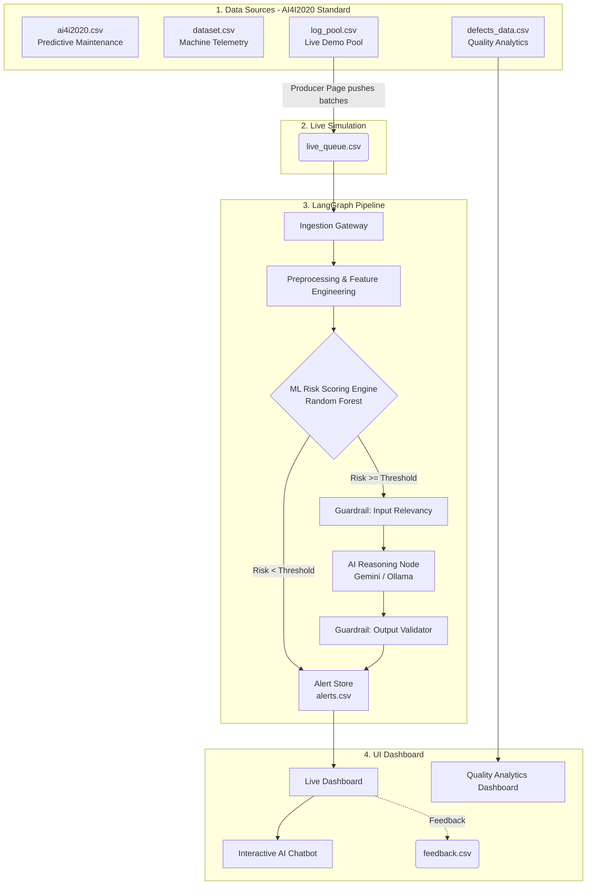

# Manufacturing defect risk platform — system architecture

**AI Friday Season 2 — Qualifiers: AI-Based Manufacturing Defect Prediction from Production Logs**

This document describes the *system architecture* — the components that exist in the
platform and how control passes between them — as distinct from a data-flow diagram.
Each box below is a real service/module in the implementation, not just a step data
passes through.

---

## 1. The 3-Dataset Flow (AI4I 2020 Standard)

This project has been upgraded to follow the industry-standard AI4I 2020 Predictive Maintenance architecture, replacing the old single-file approach with three interconnected data domains:

| Dataset | File | Role in the System |
|---|---|---|
| **Predictive Maintenance** | `ai4i2020.csv` | The core dataset containing exact physics-based sensor readings (Temperature, RPM, Torque, Tool Wear) and failure labels (TWF, HDF, PWF, OSF, RNF). **The ML model trains exclusively on this.** |
| **Machine Telemetry** | `dataset.csv` | Simulates the live MES (Manufacturing Execution System) operation log. Contains timestamps, machine status, product counts, and sensor readings. |
| **Quality Analytics** | `defects_data.csv` | Defect and repair records. Generated when a failure occurs in production. Includes realistic repair costs, severities, and inspection methods. Used by the Analytics dashboard. |

*Note: The `log_pool.csv` file is a subset of the AI4I2020 format that the model has **never seen**. It is used purely by the Producer page to simulate live incoming batches during the demo.*

---

## 2. Privacy & Operational Security

The system architecture addresses the critical requirement for **operational data security and privacy**:
1. **Synthetic Data for Development:** We generated synthetic data matching the AI4I2020 statistical properties to ensure no real proprietary manufacturing data is exposed during the hackathon or testing.
2. **Local AI Execution:** By default, the LLM reasoning agent uses **Ollama** running locally. This ensures that sensitive manufacturing telemetry, machine IDs, and product types never leave the corporate network.
3. **Guardrails as Firewalls:** The input relevancy guardrail ensures that only whitelisted telemetry structures are processed, preventing prompt injection or unauthorized data exfiltration through the AI node.

---

## 3. Ingestion gateway

A thin service that polls/receives from the simulated MES feed (`live_queue.csv`), validates the incoming schema (correct fields, correct types, batch ID present), and rejects or quarantines malformed payloads before they enter the pipeline. This is the platform's first line of defense against bad data reaching the model or the LLM.

## 3. Preprocessing service

Normalizes incoming AI4I2020 sensor readings and computes each parameter's deviation from the `spec_limits` reference (e.g. how far temperature sits outside its allowed band). Output is a clean, fixed-schema feature vector per batch, supplemented by physics-based engineered features (like power in Watts) — this is what the ML model actually consumes.

## 4. ML risk scoring engine

A **Random Forest classifier**, trained offline on historical labeled batches (`ai4i2020.csv`), loaded once at startup. For every incoming batch it outputs a `risk_score` and the ranked feature importances behind that score. This is a pure prediction service — it does not call any LLM and has no knowledge of language or reasoning; it only knows numbers.

## 5. Risk router

A simple decision component that reads `risk_score` and branches:
- **Below threshold** → batch is logged as normal, bypasses the AI agent entirely (keeps the system fast and avoids unnecessary LLM cost).
- **At or above threshold** → batch is handed to the AI reasoning agent for explanation and recommendation.

## 6. AI reasoning agent (LangGraph + Gemini / Ollama)

This is the only component in the system that calls a large language model, and it is deliberately sandwiched between two guardrails rather than being called directly. The backend can toggle between Gemini (Cloud) and Ollama (Local llama3.2:3b).

### 6.1 Guardrail — input relevancy filter
Before any prompt reaches the LLM, this guardrail checks that the payload is legitimate in-scope manufacturing telemetry (expected fields, expected numeric ranges, no injected free-text from an untrusted source). Its job is to stop prompt-injection or off-topic content from ever reaching the reasoning node.

### 6.2 Reasoning node
Given the deviated parameters, their spec limits, engineered features (like Temperature Differential and Power Output), and the feature-importance ranking from the ML model, this node generates:
- a **probable root cause** in plain language (mapping to real failure modes like Tool Wear Failure or Heat Dissipation Failure), and
- a **recommended preventive action** for the operator.

### 6.3 Guardrail — output validator
Checks the LLM's response against a fixed schema (cause + action + confidence present, correct types, no empty fields), enforces a length/format cap, and flags low-confidence or malformed outputs for **human-in-the-loop review** rather than auto-publishing them to the dashboard.

## 7. Alert store

Structured JSON output (risk level, deviated parameters, cause, recommended action, confidence) is written to `alerts.csv` — the single source of truth the dashboard reads from.

## 8. Live dashboard (Streamlit)

Reads the alert store and renders the batch table, risk flags, and per-batch drill-down (cause + action). Also includes a dedicated **Quality Analytics** page that reads the `defects_data.csv` to visualize repair costs and severity trends.

## 9. Feedback + retraining store

Operator feedback is logged to `feedback.csv`. Periodically, this feedback can be used to re-train the Random Forest model — closing the loop so the system's accuracy improves over time.

---

## Why the ML model and the LLM are separate components

Prediction (is this batch risky?) and explanation (why, and what to do about it) are different problems. Random Forest is fast, deterministic, and easy to validate with accuracy/precision/recall numbers. The LLM is good at turning "temperature and cycle time deviated" into a clear sentence a floor operator can act on — but it is not the component making the risk decision. Keeping them separate makes the system cheaper, faster, and far easier to explain to a room of judges.
